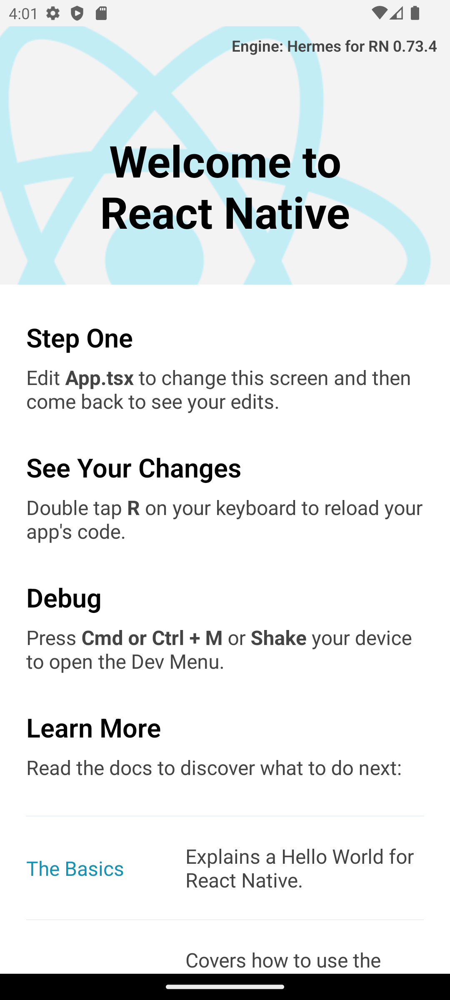

# CRIANDO O PRIMEIRO APP REACT NATIVE DO ZERO

>**Nota**: É neccessario já ter o Node, Java (JDK 17) e o SDK(33 Tiramisu) instalados, você pode fazer a instalação do Java.

>**Nota**: Em caso de erros consulte a [documentação.](https://reactnative.dev/docs/environment-setup)


## Passo 0: Se você instalou anteriormente um pacote global react-native-cli, remova-o, pois pode causar problemas inesperados:

```bash
npm uninstall -g react-native-cli @react-native-community/cli
```
## Passo 1: Criando o app

Para criar o app basta copiar o seguinte comando e inserir no terminal:

```bash
npx react-native@latest init ProjectName
```

## Passo 2: Incie o Metro em um terminal separado:

```bash
npm run start
```

## Passo 3: Incie o Metro em um terminal separado:

```bash
npm run android
```

### Você devera ver algo como isso:
